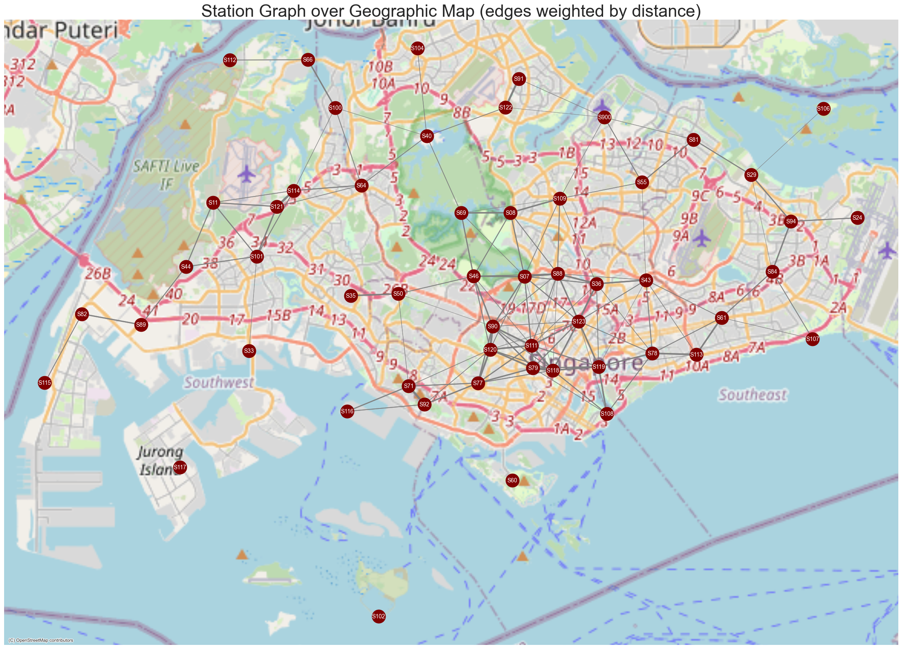
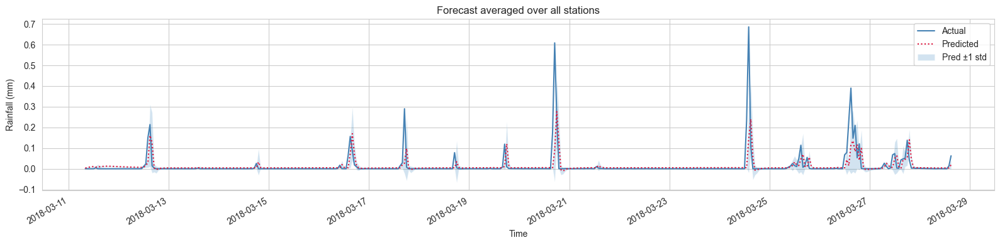

# 🌧️ STGNN Rainfall Forecasting (Notebook)

A compact, end-to-end example of using a **Spatio-Temporal Graph Neural Network (STGNN)** for **node-level rainfall forecasting**, plus a quick demo of converting **tabular station data to graph data**.

---

## What’s inside

* **Graph construction:** from `stations_meta (station_id, latitude, longitude, node_idx)` using Haversine distances → `edge_index` and distance `edge_attr`.
* **Temporal tensors:** hourly `df_hourly(timestamp, station_id, reading_value)` →
  `features[t] = X[t] ∈ ℝ^{N×F}`, **targets** `y[t] = X[t+1]` (1-step ahead).
* **Dataset wrapper:** `StaticGraphTemporalSignal` (static topology over time).
* **Model:** `GConvGRU` (Chebyshev K-hop graph conv inside a GRU) + linear head.
* **Training:** snapshot mini-batches (PyG `Batch`), truncated BPTT over `seq_len`, normalized loss.
* **Validation/Test:** per-epoch Train/Val loss, Val R²/RMSE; final Test R²/MSE/RMSE.
* **Plots:** per-station forecast; **average over all nodes** (with optional ±1 std band).
* **(Bonus) Explainability:** Simple SHAP local explanation example.



---

## Data expectations

* **Stations metadata:** `stations_meta` with columns
  `['station_id','location_latitude','location_longitude','node_idx']` where `node_idx ∈ [0, N)`.
* **Hourly readings:** `df_hourly` with columns
  `['timestamp','station_id','reading_value']`.
* The notebook pivots to arrays:
  `features.shape = (T−1, N, 1)` and `targets.shape = (T−1, N, 1)`.

---

## Setup
#### Option A: Using uv (Recommended)
```bash
# Install all dependencies from lock file
uv sync

# Activate the virtual environment
source .venv/bin/activate  # On Linux/Mac
# OR
.venv\Scripts\activate  # On Windows
```

Option B: Using pip (Traditional)
```bash
# Create virtual environment
python -m venv venv
source venv/bin/activate  # On Linux/Mac
# OR
venv\Scripts\activate  # On Windows

# Install dependencies
pip install -r requirements.txt
```

---

## How training works 

* **Split (temporal):** \~80% train / 20% test; last 10% of train → **validation**.
* **Scaling:** `StandardScaler` fit on **train** (global or per-node).
* **Batching:** each time step builds a PyG **`Batch`** = disjoint union of `B` identical graphs with different node features.
* **Unroll:** `seq_len` steps; **loss is averaged over steps** (stable across window sizes).
* **Targets:** **node-level** next-hour rainfall → model outputs `(B·N, 1)`; no graph-level pooling.

---

## Key knobs

* `seq_len` (lookback), `batch_size`, `epochs`, `lr`
* `hidden` (GConvGRU width), `K` (Chebyshev order), dropout
* Edge threshold (km) for graph connectivity

---

## Metrics & plots

* **Per-epoch:** Train loss (scaled), **Val loss (scaled), Val R², Val RMSE** (original units).
* **Final test:** **R² / MSE / RMSE** (original units).
* **Forecast visuals:** per-station curves; **mean over nodes** .

#### Forecast plot on test data:  
  

---

## Troubleshooting

* Keep `edge_index: torch.long [2,E]` and `edge_attr: torch.float [E]` as **torch tensors** (not NumPy) when batching.
* **Shuffle window starts** during **training** only; keep **val/test** chronological. Preserve order **within** each window.
* If using `torch.compile(model)`, cudagraphs may error out, especially if adding dropout or multiple `GConvGRU` layers. Consider removing `torch.compile()` if it happens.

